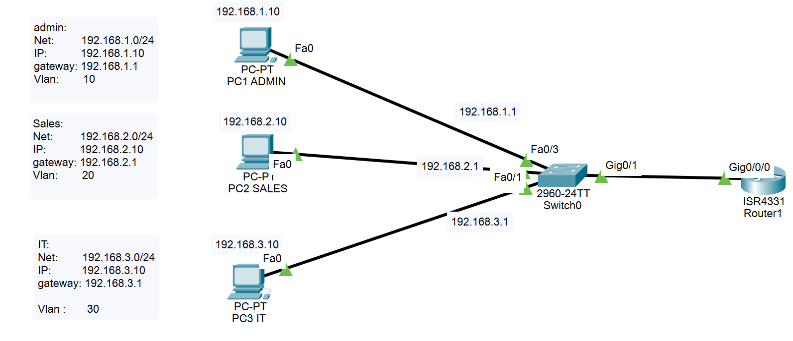
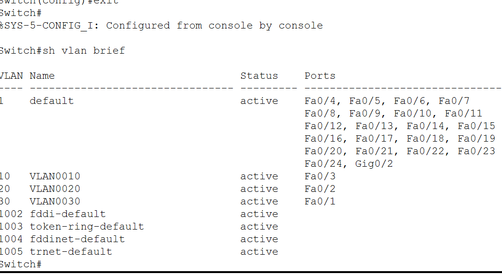
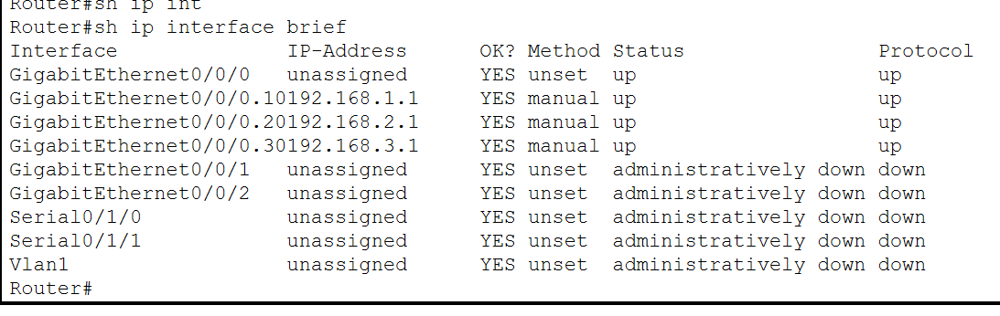
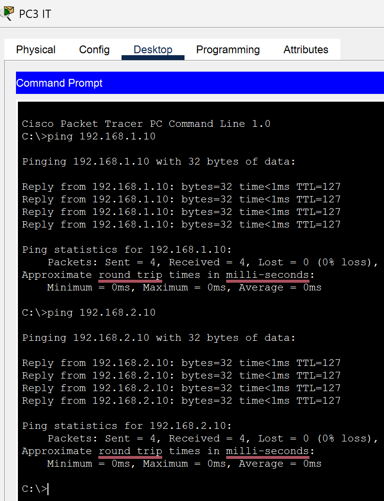
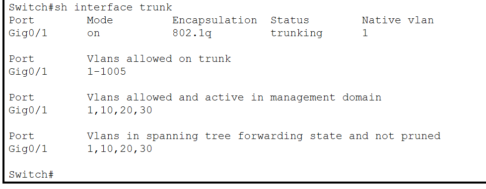
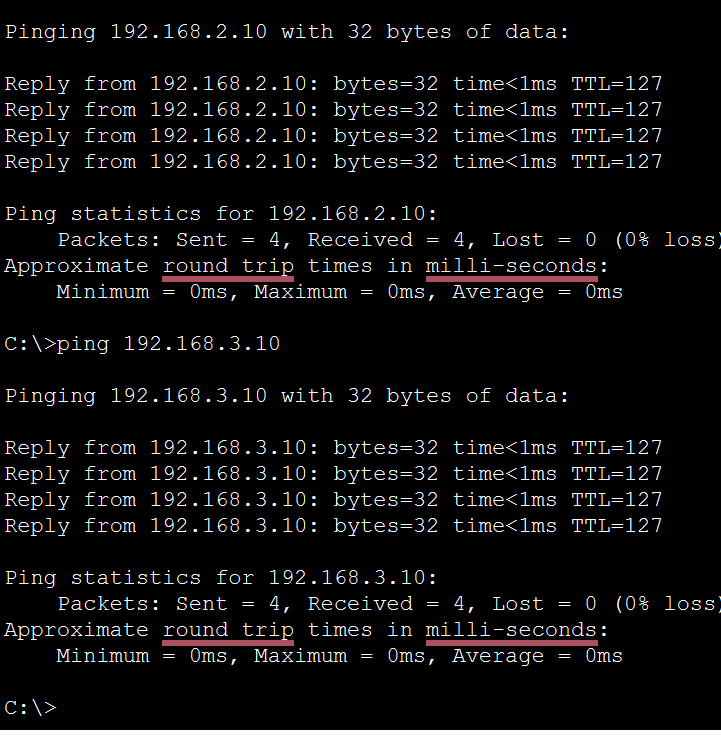
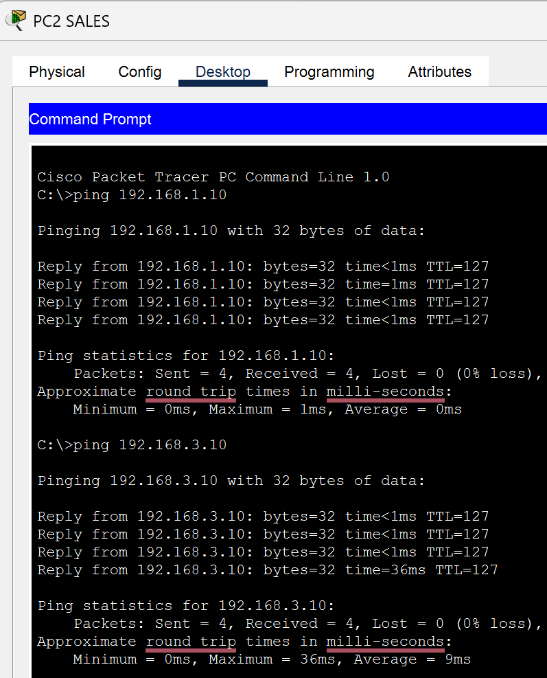

# Inter-VLAN Routing Project (Router-on-a-Stick)

## Overview
This project demonstrates how to configure Inter-VLAN Routing using a Cisco router and a switch in Cisco Packet Tracer.

The network was divided into three VLANs:
- VLAN 10 - Admin
- VLAN 20 - Sales
- VLAN 30 - IT

A trunk link was configured between the switch and the router, and router subinterfaces were used to enable communication between VLANs.

## Topology

## IP Addressing Plan

| VLAN | Department | Network | Default Gateway |
|------|------------|---------|-----------------|
| 10   | Admin      | 192.168.1.0/24 | 192.168.1.1 |
| 20   | Sales      | 192.168.2.0/24 | 192.168.2.1 |
| 30   | IT         | 192.168.3.0/24 | 192.168.3.1 |

## Switch Configuration
The switch was configured to:
- create VLAN 10, VLAN 20, and VLAN 30
- assign access ports to each VLAN
- configure a trunk link to the router

### Key Evidence
#### VLAN configuration

## Router Configuration
The router was configured with subinterfaces to enable routing between VLANs.

### Key Evidence

## Verification
Connectivity tests were performed to verify that inter-VLAN communication was working correctly.

### Ping test: Admin to Sales

## Skills Demonstrated
- VLAN creation and segmentation
- Access port configuration
- Trunk configuration
- Router-on-a-stick implementation
- Inter-VLAN routing
- Basic network verification and troubleshooting

## What I Learned
This project helped me understand how VLAN segmentation works and how a router can route traffic between multiple VLANs using subinterfaces and 802.1Q encapsulation.

<strong>Additional Evidence</strong>

 

### Trunk configuration

### Ping test: Sales to IT

### Ping test: IT to Admin

